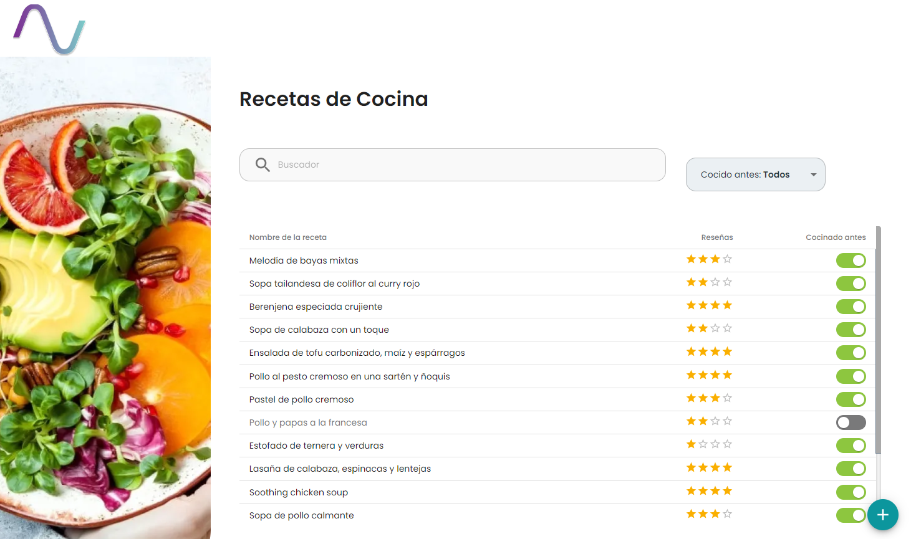
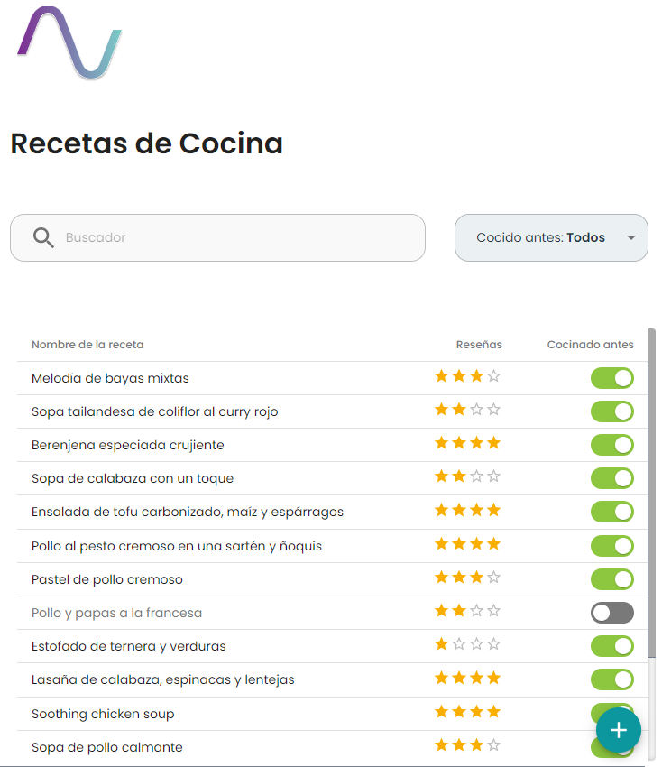
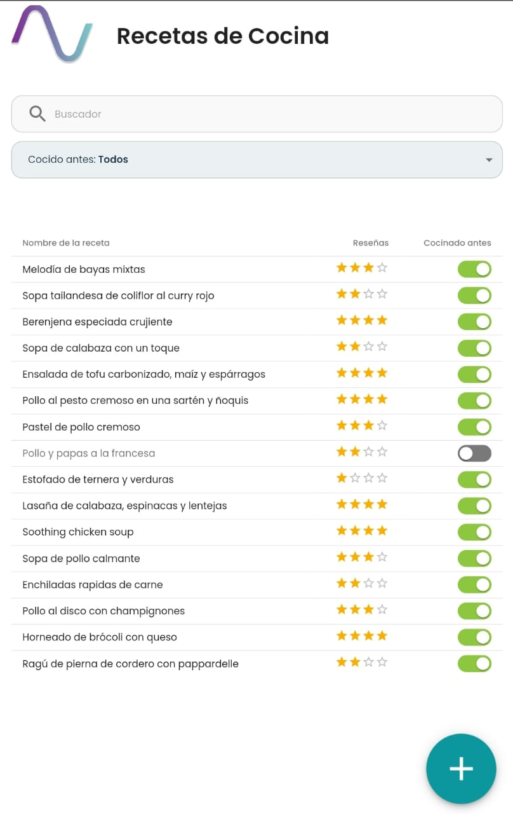

# Recetas Andinas

## Challenge Frontend SSR/SR

### Vista Desktop



### Vista Tablet



### Vista Mobile



## Elecciones de Diseño:

Para el presente proyecto se eligió utilizar el framework de diseño **Material UI**, ya que los componentes y funcionalidades requeridas, se adaptan perfectamente a las solicitadas en el prototipo.

Se utilizó la distribución de los elementos mediante **Flex** y para la implementación del comportamiento responsivo, se utilizó los **Grid de Material UI**

## Documentación del Código:

El proyecto se desarrolló en NextJS 13.0.1 implementado con TypeScript. La versión de React es 18.2.0 y se utilizó Material UI 5.10.12.

La carpeta _components_ es donde se encuentran agrupados los componentes utilizados. La carpeta _pages_ se encuentra la página utilizada: index.tsx (Home)

Para el manejo del contexto se utilizó ReactContext y en la carpeta _context_ se encuentran las distintas implementaciones.

## Implementación:

1. Instalar las dependencias:

```
yarn install
```

2. Levantar el servidor:

```
yarn dev
```

3. Dirigirse al navegador e ingresar: **localhost:3000** y ya podrán visualizar la app.

Desarrollado por: [Pablo Misael Peloc](mailto:pmpeloc@gmail.com)
